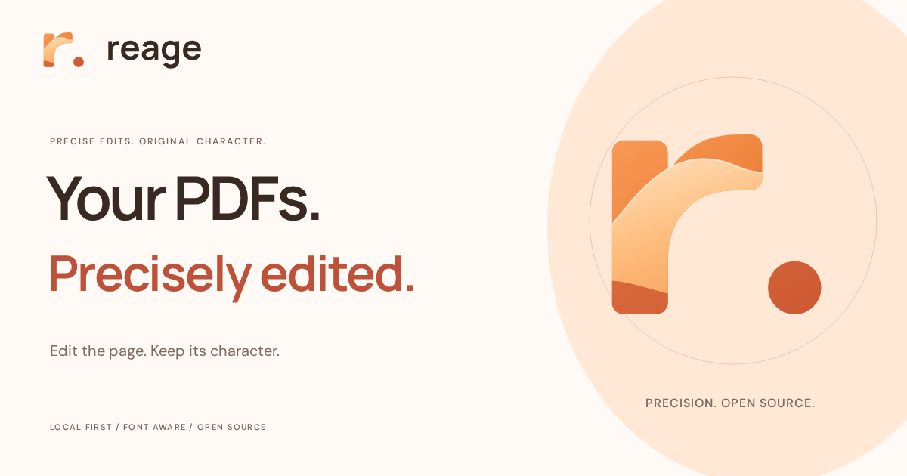

<p align="center">
  
</p>

<h1 align="center">Reage</h1>
<p align="center"><strong>A free, privacy-first, open-source alternative to Adobe Acrobat.</strong></p>
<p align="center">Edit the words. Keep the character. Online or on your own machine.</p>

<p align="center">
  <a href="https://arssshi.github.io/reage/">Try Reage online</a> ·
  <a href="#run-locally">Get started</a> ·
  <a href="docs/GUIDE.md">Guide</a> ·
  <a href="CAPABILITIES.md">Capabilities</a> ·
  <a href="https://github.com/arssshi/reage/issues">Feedback</a>
</p>

## A little less friction. A lot more yours.

Reage is a PDF editor for the moments when you need to fix a sentence,
recover a font, or edit a scanned line—without a subscription or an account.
Click text, type on the page, and export a searchable copy. Your original stays intact.

| What you can do | What makes it useful |
| --- | --- |
| **Edit directly on the page** | Native text selection, typing, undo/redo, and a compact contextual formatting bar. |
| **Style with confidence** | Real bold/italic faces, underline, strikethrough, alignment, color presets, and opacity. |
| **Make room for your ideas** | Add and duplicate text; drag to move, resize, snap to guides, or nudge with the keyboard. |
| **Keep the original character** | Reuse embedded fonts and style companions; find complete faces in the local library or the open-font catalog. |
| **Recover scanned text** | Local OCR, including English + Hindi, with reviewable text and region replacement. |
| **Find and replace** | Preview validated changes across selected text runs, then apply them in one undoable step. |
| **Check before exporting** | PDF-engine previews, font diagnostics, and an applied-edit fidelity report. |
| **Arrange your final copy** | Reorder, rotate, duplicate, remove, and extract pages; set filename/metadata and optionally subset fonts. |
| **Work comfortably** | A quiet document-first workspace, original/edited comparison, keyboard commands, and responsive controls. |

## What's new in v0.7.0 — Document Studio

The 0.7 release turns Reage into a focused document studio for precise,
single-run PDF text editing:

- **Format in context:** real bold and italic faces, underline, strikethrough,
  alignment, color presets, opacity, buffered font-size editing, and keyboard
  shortcuts without leaving the page.
- **Move and make space:** drag text, resize it, snap to page or text guides,
  lock movement with **Shift**, bypass snapping with **Alt**, or nudge with the
  arrow keys.
- **Add and duplicate text:** create searchable native text boxes anywhere and
  duplicate a run while retaining its original font, baseline relationship,
  direction, and appearance. Source artwork is left intact.
- **Edit rotated documents:** native text on 90°, 180°, and 270° page layouts
  remains selectable, editable, movable, and searchable after export.
- **Recover fonts with confidence:** Font Studio checks glyph coverage, embedded
  companion faces, local fonts, bundled families, and a complete open-font catalog.
  Substitutes and estimated scan fonts are identified clearly.
- **Arrange the final copy:** reorder, duplicate, rotate, remove, or extract
  pages; use ranges; set filename, title, and author; and optionally subset
  fonts. Partial exports keep edits on omitted pages marked as unsaved.
- **Stay oriented:** compare the original and edited document, use the
  document-first workspace on mobile, and keep the same validated PDF engine
  behind preview and export.

The release was verified with 100 backend tests, 38 local browser workflows,
25 stateless hosted workflows, startup/cache checks, real font downloads, OCR,
export/reopen checks, and a production build.

Reage edits one text run at a time. Paragraph reflow, mixed-style text inside a
run, form editing, and digital signing remain on the roadmap. OCR estimates
typography and uses solid-color backgrounds; visual region replacement is not
secure redaction. See the [full capability matrix](CAPABILITIES.md).

### A quick way to make a change

1. Open a PDF and click text to type in place.
2. Use the formatting bar for bold, italic, size, color, and alignment.
3. Press **Enter** to finish; drag the **Move** handle or the lower-right resize handle.
4. Use **Add text** for a new text object, or **Font Studio → Recover this font** for matching faces.
5. Compare with **Original**, then export directly or use the arrow beside
   **Export PDF** to arrange the output pages and set document details.

## Try it online

Open **[Reage on GitHub Pages](https://arssshi.github.io/reage/)** → try a sample or choose
a PDF → edit → **Export PDF**. No installation or account needed.

The public website is pre-rendered and served statically from GitHub Pages for
fast, crawlable HTML. PDF processing remains a separate stateless API because
GitHub Pages does not run Python services. The online workspace supports **3 MB
PDFs, up to 50 pages**. Documents and added fonts travel to the processing API
for each request; the app keeps no saved document store. For larger or sensitive
documents, use the local edition below (30 MB / 300 pages).

The public site includes pre-rendered feature pages for PDF editing, font
recovery, OCR, page organization, the user guide, privacy, and press information.
Each page has its own canonical URL, structured data, FAQ content, and internal
links so people can discover the product before loading the editor bundle.

## Your PDFs stay yours

- **Choose where processing happens.** Online mode uses temporary server processing.
  Local mode keeps PDF editing on your machine. Neither mode needs an account.
- **Transparent network use.** Optional public font downloads and first-use OCR
  language downloads need internet. Your documents are never sent to these providers.
  OCR recognition runs in the browser; online page rendering uses the server.
- **You control the files.** Export an edited copy whenever you like. Sessions are
  temporary—export before closing or refreshing. Local server sessions expire after two hours.

**Free to use, study, modify, and share under [AGPL-3.0-or-later](LICENSE).**
You can keep running and modifying your own copy under that license,
independently of a hosted service.

## Run locally

Requires **Node.js 22.13+** and **Python 3.11+**. Clone the project first:

```bash
git clone https://github.com/arssshi/reage.git
cd reage
```

<details open>
<summary><strong>macOS / Linux / WSL</strong></summary>

```bash
python3 -m venv .venv
.venv/bin/python -m pip install -r requirements.txt
npm ci
npm run build
.venv/bin/python run.py
```

</details>

<details>
<summary><strong>Windows / PowerShell</strong></summary>

```powershell
py -m venv .venv
.\.venv\Scripts\python -m pip install -r requirements.txt
npm ci
npm run build
.\.venv\Scripts\python run.py
```

</details>

Open **http://127.0.0.1:8000** → try a sample or open a PDF → click text → edit → **Export PDF**.
After setup, only the final Python command is needed to launch again.

[Setup, troubleshooting, and deployment details →](docs/GUIDE.md)

## Built in the open

**React + TypeScript · FastAPI · PyMuPDF/MuPDF · fontTools · Tesseract.js**

After installing dependencies, `npm run dev` starts both services with frontend
hot reload. Contributions, reproducible bug reports, and thoughtful ideas are welcome.

[Contributing](CONTRIBUTING.md) · [Architecture](IMPLEMENTATION.md) ·
[Testing guide](docs/GUIDE.md#verification) · [Brand kit](public/brand/BRAND-GUIDE.md) ·
[Third-party notices](NOTICE.md) · [SEO and publishing](docs/SEO.md)

## A special thank you to Omnirush 🧡

**[Omnirush](https://omnirush.ai/)** made this project possible by providing access
to frontier models that helped bring Reage from an idea to a working editor.
That access made a real difference throughout development. A heartfelt thank you
to the people behind Omnirush for helping independent builders create more.

**Explore [omnirush.ai](https://omnirush.ai/).**

---

<p align="center"><strong>Your PDFs. Precisely edited.</strong><br>Open source. Local first. Made for your words.</p>
